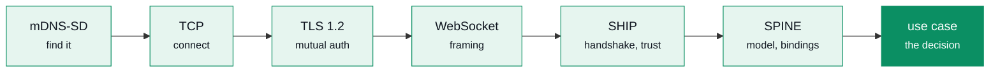

+++
title = "eebus"
template = "index.html"
[extra]
landing = true
lede = """An unofficial EEBUS implementation in Rust: the SHIP transport, the SPINE information model, and nineteen use cases on top — built to pass certification, not merely to interoperate."""
status = "Under construction. The stack is complete from the socket to the use case; the API will change and nothing is published to crates.io yet."

hero_code = """
```rust
// A heat pump answers the grid operator's limit itself —
// under §14a EnWG the acknowledgement *is* the record.
if let Some(SpineEvent::WriteRequested(w)) = engine.poll_event() {
    let write = limitation::read_limit_write(&w.resolved)?;
    let outcome = system.on_limit_write(&write, decide(&write), now);
    if outcome.is_accepted() {
        engine.accept_write(w.token, now)?;                         // ACK
    } else {
        engine.reject_write(w.token, outcome.error_number(), now);  // NACK
    }
}
```
"""

[[extra.stats]]
value = "830"
label = "SPINE types, generated"
[[extra.stats]]
value = "19"
label = "use cases, both actors"
[[extra.stats]]
value = "no_std"
label = "below the runtime"
[[extra.stats]]
value = "TLS 1.2"
label = "mutual auth, SKI-pinned"

[[extra.features]]
title = "Sans-IO protocol core"
body = "The SHIP handshake and the SPINE engine touch neither sockets nor clocks. Time is a parameter, so the two-minute hello, the SPINE response deadline and LPC's two-hour failsafe are ordinary unit tests against a virtual clock."

[[extra.features]]
title = "Certifiable, not just interoperable"
body = "The 203 abstract test cases of the four High-Level Test Specifications are carried as data and every one is driven; cargo test prints 189/203. The fourteen missing are exactly the device-level cases — a factory reset, a power cut — each listed with its reason."

[[extra.features]]
title = "Illegal states are unrepresentable"
body = "A command carries a payload choice, so two payloads in one command cannot be built. A LoadControlLimitId cannot be passed where a MeasurementId belongs — a mix-up that matters, because LPC requires the two to match."

[[extra.features]]
title = "One implementation per pair"
body = "LPC and LPP are the same use case pointed in opposite directions, as are OPEV and OSCEV. Nine use cases share one measurement layer. Each is written once, so a fix to one is a fix to all."

[[extra.features]]
title = "Runs on the controller"
body = "Everything below the runtime builds for no_std + alloc, checked in CI against thumbv7em-none-eabihf. Five fuzz targets cover everything the network can reach, because on a heat-pump controller a panic is a reboot."

[[extra.features]]
title = "Checked against other implementations"
body = "Fifteen datagrams captured from eight real devices by seven manufacturers are driven through an engine, resolved into a device model, and used to seed the fuzzers. An opt-in suite runs eebus-go's own examples in a container and drives the whole §14a exchange against them — this crate dialling, and the peer dialling in."

[[extra.features]]
title = "The wire format, directly"
body = "EEBUS JSON-UTF8 is encoded through serde in a single streaming pass — no intermediate tree to rewrite, no allocation for field names. A schema-valid message round-trips byte for byte."
+++

## The exchange, end to end

A distribution grid operator's control box tells a heat pump how much power it may draw.
Under §14a EnWG the building has to honour that limit, and the acknowledgement it sends
back is the record that it did. Every layer below is in this crate.



## Who it is for

| You are building | You need | Start at |
|---|---|---|
| A heat pump, wallbox, battery or inverter that must accept a §14a limit | the Controllable System actors, the tester hooks, `no_std` | [Getting started](@/docs/getting-started.md), then [LPC and LPP](@/docs/limitation.md) |
| An energy manager or grid control box that issues limits | the Energy Guard and Monitoring Appliance actors, `Hub` with its listener, browse and pairing | [On a network](@/docs/networking.md) |
| A gateway, simulator or test harness | the sans-IO core, without sockets | [Architecture](@/docs/architecture.md) |

## Both sides, not just the appliance

A heat pump needs the Controllable System. An energy manager needs the Energy Guard, and
the 2026 implementation guides spend most of their pages on that half. Both are here, and
the guard's rules — heartbeat before write, no deactivation as the first limit after a
reconnection, a refusal retried a minute later, one write per five minutes otherwise —
live behind a single call.

```rust
guard.require(&device, Some(LimitWrite::active(4_200.0)), now);
```

## Generated from the schemas, not from a reading of them

830 SPINE types and 47 SHIP messages are emitted from the XML Schemas the specifications
ship, so the model cannot drift from the standard. The generated Rust is committed:
building the crate never needs the specifications.

## Checked against implementations it did not write

Round trips over fixtures a crate wrote itself prove that its encoder agrees with its
decoder, which is not the question anyone is asking. Two things answer the real one.

**Recorded traffic.** Fifteen datagrams captured from eight real devices by seven
manufacturers — Elli, evcc, Kostal, Porsche, SMA, Spelsberg, Vaillant, Viessmann — are
driven through an engine, resolved into a device model, and used to seed the fuzzers, so the
corpus explores the shapes real hardware produces.

**A live peer.** An opt-in suite runs `eebus-go`'s own examples in a container at a pinned
revision and drives the whole §14a exchange against them in both directions: their control
box against this crate's Controllable System, their EVSE against its Energy Guard.

## One rule you cannot get wrong twice

Restricted Function Exchange merges partial updates element by element: an omitted element
means *unchanged*, all the way down. Send a `scaledNumber` carrying a bare `number` and
the stored `scale` has to survive — otherwise a 4.2 kW limit silently becomes 42 MW. The
generator resolves the type-to-selector link the schemas leave implicit into a table over
141 functions, and the merge is written once.
