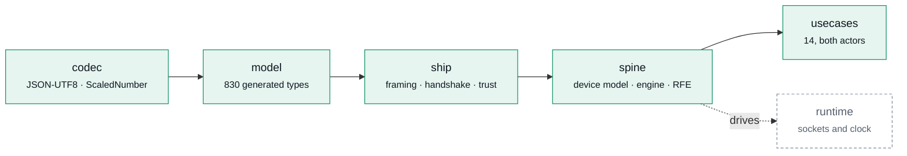

+++
title = "Architecture"
description = "One layered crate, a sans-IO protocol core, feature flags instead of a family of crates, and a model generated from the specifications' own XML Schemas."
weight = 30
[extra]
group = "Foundations"
+++

## One crate, layered



Each layer depends only on those to its left. `runtime` is the only module that opens a
socket or reads a clock, and it sits outside the dependency chain rather than inside it.

Feature flags rather than a family of crates: `eebus-codec`, `eebus-ship`, `eebus-spine`
and friends would have to be version-locked to each other forever, and the boundary they
would enforce is already enforced by the module graph.

## Sans-IO

Neither protocol core touches a socket or a clock. Both are driven identically:

```rust
handshake.handle_message(&msg, now);      engine.handle_datagram(&datagram, now);
handshake.handle_timeout(now);            engine.handle_timeout(now);

handshake.poll_transmit();                engine.poll_transmit();
handshake.poll_timeout();                 engine.poll_timeout();
handshake.poll_event();                   engine.poll_event();
```

Time is a parameter. That is the whole trick, and it buys three things:

**Every timeout in the standard is an ordinary unit test.** The two-minute hello
prolongation, SHIP's PIN penalty, the SPINE ten-second response deadline, LPC's two-hour
failsafe — each is a few lines against a virtual clock, running in microseconds. Testing a
two-hour timeout by waiting two hours is not testing it.

**The same code runs anywhere.** Under Tokio, inside a simulator, on a microcontroller
with a bare TCP stack, or in a fuzz target that feeds it bytes with no I/O at all.

**Failure is reproducible.** A packet trace and a timestamp sequence reproduce a bug
exactly, because there is nothing else the core can depend on.

## Generated from the schemas

The SPINE and SHIP specifications ship XML Schemas. `cargo xtask codegen` reads them and
emits 830 SPINE types and 47 SHIP messages, so the model cannot drift from the standard by
transcription error. The generated Rust is committed, so building the crate never needs the
specifications; the generator normalises its output through rustfmt, so re-running it when
nothing has changed produces no diff.

See [Regenerating the model](@/docs/codegen.md).

**Macros, not emitted implementations.** The generated model is 830 types. Emitting
`Serialize`/`Deserialize` for each would be some 30,000 lines nobody reads, in which a
wire-format bug could hide in a single type. So the generator emits declarations only, and
the encoding rules live in ten hand-written, hand-tested macros — a fix to the wire format
is a fix everywhere.

## Illegal states are unrepresentable

A SPINE command carries a payload *choice*, so "two payloads in one command" cannot be
constructed. Identifiers are distinct newtypes, so a `LoadControlLimitId` cannot be passed
where a `MeasurementId` belongs — a mix-up that matters in practice, because LPC requires a
limit's `measurementId` to match the one MPC reports against.

## no_std

Everything below `runtime` builds for `no_std + alloc`, checked in CI against
`thumbv7em-none-eabihf` — a Cortex-M4F, the class of part a heat-pump controller actually
uses. See [Embedded targets](@/docs/embedded.md).

## Feature flags

| Feature | Default | Effect |
|---|---|---|
| `std` | ✅ | Standard library. Without it the crate builds `no_std + alloc`. |
| `pairing` | ✅ | SHIP Pairing Service (`hmac`, `sha2`). |
| `conformance` | ✅ | The 203 abstract test cases as data. Tens of kilobytes of static strings a device in the field never reads, so a firmware build leaves it out. |
| `cert` | — | Generating and reading node certificates (`rcgen`, `x509-parser`). |
| `tls` | — | TLS 1.2 as SHIP §9 requires it (`rustls`). |
| `runtime` | — | Sockets on Tokio: TCP, TLS, WebSocket, the handshake, the connection table, pairing. |
| `mdns` | — | `_ship._tcp` announcement and discovery, and `_shippairing._tcp` with `pairing` (`mdns-sd`). |
| `ring` | — | `rustls` and `rcgen` backed by `ring`. |
| `aws-lc-rs` | — | The same, backed by `aws-lc-rs`. |
| `interop` | — | The cross-implementation test suite. Needs Docker; nothing in the library depends on it, and `full` deliberately excludes it. |
| `full` | — | Everything above, on `ring`. |

`runtime` implies `tls` and `cert`. A device that only parses datagrams — a test harness,
a gateway, a simulator — pays for none of them.

All three of those also need a cryptography provider, and the crate names neither: exactly
one of `ring` and `aws-lc-rs` must be selected, or the build stops with a `compile_error!`
saying so. `rustls`' provider is process-global, so the choice belongs to whoever builds the
binary rather than to a library in the middle of it —
[the security model](@/docs/security.md#the-cryptography-provider-is-the-consumer-s-choice)
has the reasoning.

That makes `--all-features` a configuration that cannot exist. `--features full` is
everything, on `ring`, and it is what CI and docs.rs build.
