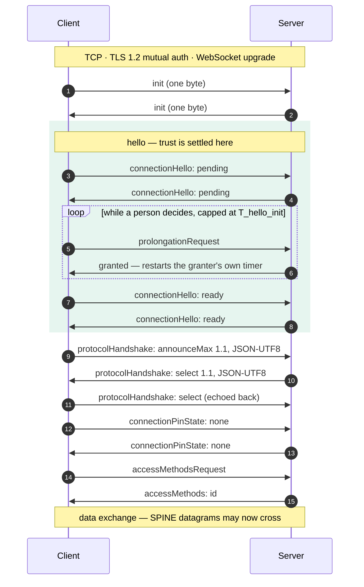

+++
title = "SHIP: the transport"
description = "SHIP explained: mDNS-SD discovery, TLS 1.2 with mutual authentication, the five-phase handshake, trust by Subject Key Identifier, and double-connection resolution."
weight = 50
[extra]
group = "Protocol"
+++

SHIP — *Smart Home IP* — gets two devices from "on the same LAN" to "exchanging SPINE
datagrams". It covers discovery, transport security, trust establishment and framing, and
it is where most interoperability failures actually happen.

## Finding a peer

A SHIP node announces itself over mDNS-SD as `_ship._tcp.local`, with a TXT record
carrying its identity and state:

```text
id=Demo-HeatPump-123456    the SHIP ID
ski=43c9da85a18329d6…      the Subject Key Identifier, 40 hex characters
path=/ship/                the WebSocket path
register=false             whether it is inviting pairing
```

`register` is **never** `true` in this crate: SHIP IG §2.3 forbids advertising open
registration, and forbids an "auto accept" mode along with it. Pairing is a deliberate act.

With the `mdns` feature the crate both announces and browses; without it you supply the
address yourself.

## Identity is the certificate

There is no username, no central authority and no PKI. A node holds a self-signed ECDSA
P-256 certificate, and its name is the **Subject Key Identifier** — twenty bytes derived
from the public key, written as forty hex characters. Two devices are paired when each has
recorded the other's SKI. Everything else follows from that.

The consequences are worth stating plainly, because they are unusual:

* Trust is per-node and symmetric. There is nobody to revoke it centrally.
* A certificate cannot be replaced casually — replacing it changes the node's name. SHIP
  §12.1.3 defines a rotation procedure with an `updateCounter` for exactly this reason.
* **Session resumption is off.** §9.6 makes it a SHOULD, but a resumed session skips the
  certificate exchange, and the certificate is what identifies the peer.

## TLS 1.2, and only 1.2

SHIP §9 says TLS 1.3 "is not considered in this version", so the crate offers 1.2 with
mutual authentication and the cipher suites §9.1 mandates. A peer offering only CBC suites
will not connect.

The `cert` feature generates conforming node certificates. One detail is easy to miss and
fatal: `rcgen` writes the Subject Key Identifier extension only for certificate
authorities, and a SHIP node certificate is a leaf. Without the extension written by hand
the field §12.2 expects is simply absent, and a peer cannot identify the node at all.

## The handshake

Once the WebSocket is up, five phases run before any SPINE datagram may cross (§13.4.3–13.4.8):

1. **`init`** — a single byte in each direction.
2. **`hello`** — each side declares whether it is `ready`, `pending` or `aborted`, with a
   waiting time. Trust is settled here: an untrusted peer stays `pending` while the user is
   asked, and the wait is prolonged for as long as the decision takes. `T_hello_init` is
   two minutes and a person takes longer, so the prolongation is what carries a
   commissioning through: the `pending` node asks, and granting a request restarts the
   granter's own Wait-For-Ready-Timer (§13.4.4.1.3). It is not unbounded — a Wait-For-Ready
   timer that expires aborts, whichever phase the node is in — but once the peer has
   announced `ready` the pending node retires its own timer and keeps the connection up by
   asking, which is what gives a person as long as the peer will allow. On a network the
   `Hub` reports the waiting peer as `TrustRequested`, and `approve` or `refuse` answers it
   in place — [Pairing](@/docs/networking.md#pairing).
3. **`protocolHandshake`** — agree the SHIP version and the message format. JSON-UTF8 in
   practice; the specification allows others. §13.4.4.2.2 requires support for every version
   from 1.0 up to a node's own maximum, so two peers settle on the lower. `Node::handshake_config`
   sets the ceiling — `ShipVersion::V1_0` pins a device to the certification minimum — and
   `ShipConnection::ship_version`, `Hub::ship_version` and `HubEvent::Connected` report what
   came of it. It matters: 1.0 has no `accessMethods.id`, so a 1.0 peer cannot be dialled back.
4. **`pinVerification`** — optional, with penalties for wrong attempts.
5. **`accessMethods`** — exchange identities. `accessMethods.id` is populated, which SHIP
   1.1.0 makes mandatory and which a peer needs in order to dial back in the other
   direction.



The close handshake (§13.4.8) is symmetric and equally required; dropping the socket is not
a close.

```rust
handshake.handle_message(&msg, now);   // a frame arrived
handshake.poll_transmit();             // frames to send
handshake.poll_timeout();              // when the next SHIP timer fires
handshake.poll_event();                // "trust needed", "ready", "closed"
```

## The Pairing Service

Beyond manual SKI approval, the Pairing Service 1.0.0 lets an installer configure a
control unit from a QR code and have trust established with nobody asked anything. It is
behind the `pairing` feature, on by default, and both roles are implemented: `devA`, the
household device that evaluates requests (§9), and `devZ`, the control unit that announces
them (§8). The digest is an HMAC-SHA256 over the TXT record's fields in the order §7 fixes,
keyed by the printed secret and a fresh nonce, and a replay guard (§11) refuses a captured
announcement twice.

What is trusted is a **certificate fingerprint** rather than a SKI: §10.2 has it checked at
the TLS handshake and treated as equivalent, and §10.3 allows one control unit at a time.
Trust lives in the same store as SHIP's (§10.4). The timing rules are the subtle part —
when a request is on the air (§4.2) and when a node will look at one at all (§4.3) — and
both are worked through in [Pairing](@/docs/networking.md#or-nobody-is-asked-at-all); the
two simulators do the whole exchange over a real network.

`Fingerprint` is the SHA-256 of the DER certificate in the 64-uppercase-hex wire form, and
it is strict about case: the digest covers the text as sent, so a lowercase value would
mean verifying a message the sender never signed.

Keys the QR payload grammar gains later are skipped on the way in (`SRIP-310/15`) and
written back out unchanged, so a tool that re-renders a code — onto a screen after a
certificate update, say — does not strip fields it happens not to understand.

## Two nodes that dial each other at once

If both peers discover each other simultaneously, both dial, and two connections exist
where one should. SHIP §12.2.3 resolves it deterministically: the node with the **larger
SKI** keeps the **most recent** connection and drops the older; the node with the smaller
SKI waits three seconds and then pings to confirm which survived.

Both halves are implemented, and the rule has a flaw worth knowing about. **"The most
recent connection" is a local judgement** — each node decides it from its own clock, about
two events milliseconds apart on two machines, and nothing makes the two agree.
`enbility`'s [2025 analysis of SHIP](https://enbility.net/blog/20250704-analysis-documents/)
shows this can end with both connections closed and none left; `ship-go` deviates
deliberately, keeping the *initiator's* connection, which both ends judge identically.

This crate follows §12.2.3 — a laboratory tests the specification, not a reference
implementation — and bounds the hazard instead: the smaller-SKI side runs exactly one ping
round and then decides, and a lost connection is redialled. Interoperating with `ship-go`
needs no compatibility switch: whichever rule the far end applies, one side closes something
and the other's bounded fallback settles the rest. See
[Conformance](@/docs/conformance.md).

## Framing

SHIP messages are length-prefixed binary frames with a one-byte type. The framing layer is
one of the five fuzz targets, because it is the first thing an attacker on the LAN reaches.
