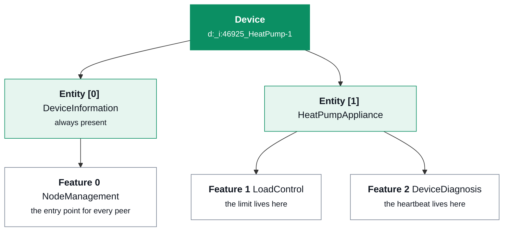

+++
title = "SPINE: the model and the protocol"
description = "The SPINE device model, addressing, NodeManagement discovery, bindings and subscriptions, acknowledgements, and Restricted Function Exchange with its merge rule."
weight = 60
[extra]
group = "Protocol"
+++

SPINE defines what a device *says it is* and how peers read, write and subscribe to it.

## The model



An entity path is a list, so entities nest. A **feature address** is the triple
`device / entity / feature`, and it is what every message carries as source and destination.

A feature declares a **role** — server (holds the data) or client (asks for it) — and, per
function, which **operations** are possible: read, write, and whether partial forms are
supported. `possibleOperations` is a promise, and the crate treats it as one: it announces
a partial read only for functions it can genuinely restrict.

## Discovery

Every conversation begins at NodeManagement on entity 0.

* **Detailed discovery** (§7.1) — "what are you?" Returns the whole tree: entities,
  features, roles, functions, operations.
* **Use-case discovery** (§7.3) — "what do you do?" Returns
  `nodeManagementUseCaseData`: the use cases played, the actor played in each, and which
  numbered scenarios are supported.

An application that skips the second and guesses from feature types will eventually meet a
device that has a `LoadControl` feature for an unrelated reason.

Two details worth knowing before writing a client:

**A read names its function in either of two spellings** — the `function` element, or an
empty instance of the data element. `spine-go` uses the second exclusively, so a reader that
understands only the first cannot answer most of the deployed base, and a writer that sends
only the first is answered `errorNumber` 6. The specification's own example reads carry
both, and so does this crate.

**A feature is identified by its type *and* its role.** An entity may hold a
`DeviceDiagnosis` server and a `DeviceDiagnosis` client at once — `evcc` and the Porsche
Mobile Charger Connect both ship exactly that — and a Controllable System needs to, because
it serves its own heartbeat and subscribes to the Energy Guard's. A subscription runs
client → server, so the near end of that one must be the client feature.

### When the tree changes underneath you

§7.1.5 and §7.5.4 let a device add, remove or modify its entities and use cases while a peer
is connected — a car that is plugged in and drives away, a DHW circuit that is
decommissioned. Both changes are a **notify** carrying only what changed.

```rust
engine.subscribe_to_discovery(&peer_device, now);  // `Hub` does this for you
engine.add_entity(LocalEntity::new([2], EntityType::Compressor), now)?;
let gone = engine.remove_entity(&[1, 1], now)?;    // and everything beneath it
```

A removal also releases the bindings and subscriptions that named the entity's features, and
drops the use cases it announced.

Two things here are easy to get wrong, and both decide whether a peer tracks the tree or
quietly loses it:

* **Subscribe, or hear nothing.** §7.5.4: "a device that uses use case discovery **should
  always subscribe** to use case discovery". An *arrival* shows up in any re-read; a
  *departure* does not, because a discovery document merges and a shorter re-send says
  nothing about what went. `lastStateChange: removed` on a notify is the whole mechanism, and
  EVCC scenario 8 — the car that left — is that message and nothing else. One subscription
  covers both functions, since §7.4.1 permits only whole-feature ones.
* **Neither discovery function is a list the generic merge can address.** Detailed discovery
  is three parallel lists inside one value; a `useCaseInformation` entry is keyed by an
  `address` the wire makes optional and an `actor`, which is not an identifier type. Merged
  the ordinary way, an update naming one new entity *replaces* the list. Both are merged by
  their own sections' rules instead.

## Bindings and subscriptions

Two distinct grants, easily confused:

* A **binding** grants the right to *write* to a feature that requires one.
* A **subscription** asks to be *notified* when data changes.

LPC requires both, in that order, and requires the Energy Guard to have subscribed to the
heartbeat *before* it writes a limit. A single-writer policy applies: a feature accepts a
binding from one client, and the group lock the LPC implementation guide §3.5 describes is
enforced here rather than left to the application.

### "…that requires one"

§7.3 puts the requirement on the **feature**: "please note that some feature types define
requirements for binding!" — and the SPINE test specification follows it rather than
stating a blanket rule. `TC_SPINE_BIND_002` has the device under test reject an unbound
write "if the target feature **requires** a binding (e.g. LoadControl)".

The use cases say which features those are, and they do not agree — LPC/LPP and their
relatives require one, every HVAC use case says "Binding SHOULD NOT be used for this
Scenario". So `WriteBinding` is per feature:

```rust
limitation::load_control_feature(1);   // WriteBinding::Required — the default
cdt::setpoint_feature(1);              // WriteBinding::NotRequired — CDT §3.4.1.1
```

The default is `Required`, which is the safe way round: a feature that should have been
open refuses a write a conformant peer will retry and complain about, where one that should
have been closed accepts a write from anybody. See
[Who may write, and who may not](@/docs/use-cases.md) for the split by use case.

Unchanged data is not notified (SPINE IG §2.4). That is what makes a dozen subscriptions
affordable on a small controller, and it is also why the age of a subscribed value says
nothing about the peer: a room holding its temperature sends nothing at all. What silence
*does* mean is a property of the use case, and the descriptors carry it — see
[Who has to subscribe, and what silence means](@/docs/use-cases.md).

Both tables are readable — `nodeManagementBindingData` and `nodeManagementSubscriptionData`
(§7.3.2, §7.4.2) — and both are answered from the relations actually held.

**A relation belongs to both partners.** §7.4.1 rule 4: "Subscription information SHALL be
kept persistently by both subscription partners", and §7.4.3 has each entry describe "the
relation of an own feature to one feature of a subscription partner" — either direction. So
the two directions are different questions with different answers:

```rust
relations.is_bound(&their_client, &our_server);      // may this peer write to us?
relations.holds_binding(&our_client, &their_server); // did a peer grant us one?
```

A relation this device *holds* carries no identifier: Table 18 makes `subscriptionId`
optional and says the value is "a **server's** unique ID", which is the peer's to assign.

**And the table is tailored to who is reading it.** §7.4.3: "no subscription entries of a
third device C are exchanged between A and B". Serving the whole table tells every peer which
other peers this device is talking to — on a §14a box, the grid operator's relationship with
the household. Where nothing concerns the recipient the element is *absent* rather than
empty, a distinction Table 18 makes deliberately.

**A request or a release is honoured only in the sender's own name.** The call names its
client address in the payload, and the engine accepts it only when that address belongs to
the device SHIP authenticated as the sender — a peer that leaves the device part out has it
filled in from the header, which is how `spine-go` phrases it; a peer that names another
device is answered `errorNumber` 7. Nothing in §7.3 gives a binding's client authority over
anybody else's, and without the check one paired peer could release another's binding.

**And a peer cannot hold relations without end.** Each device may hold at most
`MAX_RELATIONS_PER_PEER` bindings and as many subscriptions; a request past that is answered
`errorNumber` 3. A peer chooses its client addresses freely — a fresh entity path per
request — so without a bound the two tables would grow on the word of whoever is on the
wire.

## Deciding a write

A feature may hand its writes to the application instead of storing them, which is what LPC
needs: the acknowledgement *is* the record that the limit was applied, so only the appliance
can produce it. The engine reports `SpineEvent::WriteRequested` and waits. It carries two
payloads:

* `data` — what arrived, exactly. It says *which* entries the write addresses, and it is
  the record of what was asked for.
* `resolved` — what the function would hold if the write were accepted: `data` merged into
  what is stored.

Decide on `resolved`. A partial write carries only what changed, so an absent
`isLimitActive` means "unchanged", not "deactivate".

`accept_write` answers with whether the engine could *store* what was accepted: a merged
list that would exceed the bound, say, reaches the peer as `errorNumber` 3 rather than as an
acknowledgement, and the use case has to know that, because a §14a record that said
"accepted" while the wire said otherwise would be evidence of something that did not
happen. The limitation actors handle it: the record says what the peer was told, and the
state machine is put where a refused write leaves it.

A write is refused with `errorNumber` 7 when an entry arrives without its primary and sub
identifiers, which use-case IG §3.1 requires in every message: such an entry names nothing
stored, so it can neither update nor delete.

**A partial write cannot grow a list without end.** Appending an entry whose identifier
matches nothing stored is correct behaviour, and repeated with a fresh identifier it is a
way to spend a controller's memory over a legitimate protocol flow. One function holds at
most 128 entries, and a write that would exceed that is refused whole.

**And the queue of undecided writes is bounded.** A deferred write is memory the *peer*
allocates and the application frees, so at most sixteen may wait; beyond that a peer is
answered `errorNumber` 3, overload. One that goes undecided past §5.2.5's maximum response
delay is abandoned and reported as `SpineEvent::WriteAbandoned` — answering later would
reach a peer that had already given up.

**A write whose result the application owns is stored as the application says.**
`accept_write` stores what the peer sent, merged into what was there — right wherever SPINE
gives entries identifiers, because the merge can address them. For a function that is one
value rather than a list it is not: [OHPCF](@/docs/hot-water.md)'s partial write is
mandatory, and merging its two-field fragment replaces everything the compressor announced —
which §7.4.1 then notifies to every subscriber, the writer included.

```rust
match compressor.apply(&write.resolved) {
    Ok(_)        => engine.accept_write_with(write.token, compressor.data(), now)?,
    Err(refused) => { engine.reject_write(write.token, refused.error_number(), now); }
}
```

## Acknowledgements and errors

A message may request an acknowledgement, and whether one is owed depends on the classifier,
the outcome and the request together (§5.2.5.1). A successful `read` is answered by the
reply itself, never by a separate result; a failed one still owes an error. A `result` is
never answered by a result — that way lies a loop.

```rust
owes_ack(CmdClassifier::Read,  true,  ErrorNumber::None);                 // false
owes_ack(CmdClassifier::Read,  true,  ErrorNumber::CommandNotSupported);  // true
owes_ack(CmdClassifier::Write, true,  ErrorNumber::None);                 // true
owes_ack(CmdClassifier::Write, false, ErrorNumber::None);                 // false
```

Message counters are per-source, and tracked over a window rather than as a high-water
mark: §5.2.4 makes `msgCounter` a sender-unique name for `msgCounterReference` to point at,
and a peer that allocates it in one task and writes the datagram from another sends them
interleaved. A receiver that kept only the highest would read the overtaken message as a
duplicate and drop it, unanswered. A datagram addressed to a device that is not this one is
answered `DestinationUnreachable` rather than ignored.

**A payload carries exactly one command** (§5.3.2), and one that carries none or two is
answered `errorNumber` 1. The schema permits several, so a peer can send them, but a
single `result` cannot report two outcomes — so the datagram is refused whole rather than
half-applied. Several *filters* in one command are a different thing, and supported.

`specificationVersion` is checked, and a malformed one is refused —
`TC_SPINE_COMP_006` calls that the recommended behaviour — while tolerating the one
deviation it permits, a leading `v`.

## What a peer's address has to be

A device address is a routing key and a stored identity: the hub binds a connection to it,
the engine allocates a peer record per distinct one, and every § 14a audit record names it.
Two rules apply, and they are deliberately different.

**What this node builds** goes through the full §7.1.1.2 pattern,
`d:_(i:<IANA PEN>|n:<vendor>)_<unique>`.

**What a peer sends** is checked only for what protects this node: bounded length, no
control or whitespace characters, not empty. A datagram whose source fails that is discarded
in silence, because there is nowhere to send an error to.

Enforcing conformance on reception would mean refusing `evcc`, which announces
`d:_i:EVCC_HEMS-…` — the `i:` marker without the IANA Private Enterprise Number it is
reserved for. So the deviation is tolerated and *measured*: a test names which addresses in
the device corpus are non-conformant, so a third one is a failure rather than a surprise.

## How long a peer is given to answer

Ten seconds (§5.2.5.3), unless the feature announced longer in its detailed discovery — in
which case that. A client that ignores the announcement reports a conformant peer as
*unresponsive*, and the implementation guide reserves the staggered retry for exactly that,
so the guess retries against a peer answering as fast as it promised.

`LocalFeature::with_max_response_delay` declares this node's own figure. Discovery publishes
it, and it is also how long the engine holds a *deferred write* on that feature open — a
Controllable System that must ask a compressor controller before it can answer a limit needs
both halves.

## When a peer says nothing at all

A refusal and a silence are different facts. A `resultData` carrying an error is a completed
exchange, and §2.6.1 forbids retrying it. No answer at all is the other thing, and §2.6.2
gives the escalation path in numbers: retry after 30 seconds, then 5 minutes, then 15, then
give up. `RETRY_SCHEDULE` is those numbers, and the engine walks them so no use case has to.

A *request* outlives the transmissions carrying it. SPINE has no retransmission of its own
and a repeated `msgCounter` is a duplicate a conformant receiver drops, so each retry goes
out under a counter of its own — but the counter you were handed is still the one your
acknowledgement arrives under. `SpineEvent::RequestRetried` reports the rungs;
`SpineEvent::RequestTimedOut` fires only at the end, so it means an unresponsive peer rather
than a lost datagram, and an actor can safely release what it was holding for that request.

The engine does not close the connection — §2.6.2's fourth step — because it owns none, and
§2.6.4 says one unresponsive use case is not a reason to drop a connection carrying others.
`Hub` passes the event up, which is where that decision belongs.

## Restricted Function Exchange

RFE is how SPINE reads and writes *part* of a function: a **selector** says which entries,
an **elements** filter says which fields of them.

```rust
data.restrict(selectors, elements)?;                     // what a partial read answers with
rfe::apply_partial(&mut stored, update);                 // merge by identifier, element by element
data.delete_restricted(&update, selectors, elements)?;   // what a delete filter addresses
```

**The merge rule is the part to get right.** An omitted element means *unchanged*, all the
way down the tree. A `scaledNumber` arriving with a bare `number` must keep its stored
`scale`, or a 4.2 kW limit becomes 42 MW.

**It applies to what a peer sends you, not only to what it writes.** A server may notify a
*partial* update — the implementation guide §3.2.2 asks clients to subscribe rather than
poll, so that is the ordinary shape a measurement arrives in. The engine therefore keeps the
merged state of every function a peer has sent, and `SpineEvent::DataNotified` and
`ReplyReceived` carry `data` for what arrived and `resolved` for what it means, exactly as a
deferred write does. Read `resolved`.

**A delete is filtered too, and a command may carry more than one filter.** `selectors`
choose the entries a delete addresses; `elements` choose the parts of them, and the entries
survive. LPC UC TS §3.4.1.4's worked example is one command with two filters — the first
withdraws a limit's `timePeriod.endTime`, the second writes its new value as a partial
update — so a command's filters are applied **in order**. Answering only the delete removes
the limit instead of making it open-ended.

`Engine::write_filtered` sends that shape, and the Energy Guard uses it unasked: a limit
with no duration always carries the delete that withdraws the old `endTime`. It has to —
an absent element means unchanged, so omitting the `timePeriod` leaves the previous end
time in force and a limit meant to be open-ended lapses when the old one would have.

**Reads go the same way.** `Engine::read_filtered` asks for part of a function, which §7.1.3
and §7.5.3 both want by name: "where is your `LoadControl` feature?" and "do you play the
Controllable System?" are a few hundred bytes instead of a large device's whole tree. The
peer answers with a subset marked partial, and the merge above is what keeps a narrow
question from discarding the answer to a wide one.

Nothing in the XML Schemas links a data type to its selectors and elements filters — the
link is a naming convention — so the generator resolves it into a table covering 141
functions, and merge, delete and partial read are written once against that table. Which
elements *identify* an entry is the schemas' other silence, and is
[answered from the specification's own table](@/docs/codegen.md) rather than from a pattern.

A filtered request for a function the table does not cover is refused with `errorNumber` 8
rather than answered approximately. Announcing what you cannot do is worse than announcing
less. The table itself is published:
[which functions can be exchanged in part](@/docs/functions.md), generated from the same
source the compiler reads.
